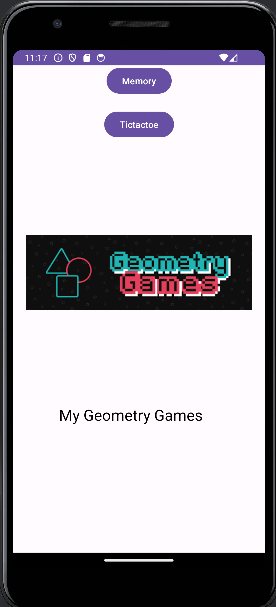
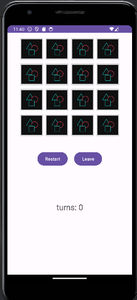
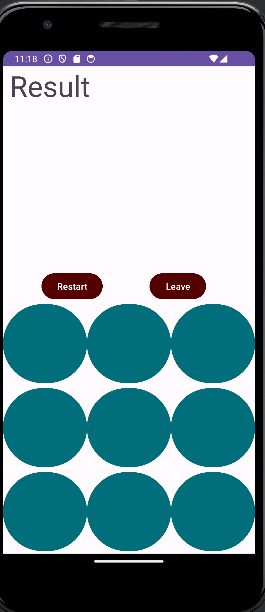
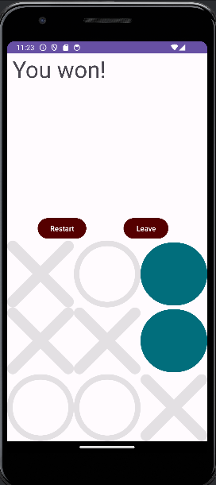
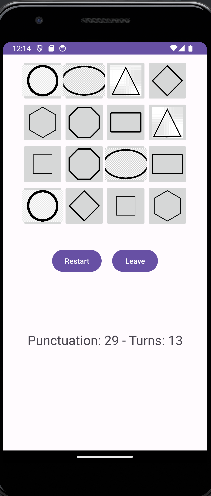

# Minigames Android

This repository contains two small Android games: Memory and Tic Tac Toe.

## Technologies Used:

- Java
- Android Studio

## Overview

The project consists of two mini-games accessible through the menu:

### Memory Game

In the Memory game, players need to match pairs of cards within a certain number of turns. The game keeps track of the score and number of turns taken.

### Tic Tac Toe

Tic Tac Toe is a classic two-player game where players take turns marking spaces on a 3x3 grid. The first player to get three of their marks in a row wins.

## How to Run:

To run the project:

1. Clone the repository to your local machine.
2. Open the project in Android Studio.
3. Compile and run the project on an Android emulator or device.

### Installation via APK:

- Download the APK file from the repository.
- Install the APK on your Android device and launch the app.
  
### Screenshots:

- Menu of the mini-games: 
- Memory Game Layout: 
- Tic Tac Toe Layout: 
- Tic Tac Toe Win Screen: 
- Memory Game Win Screen: 
